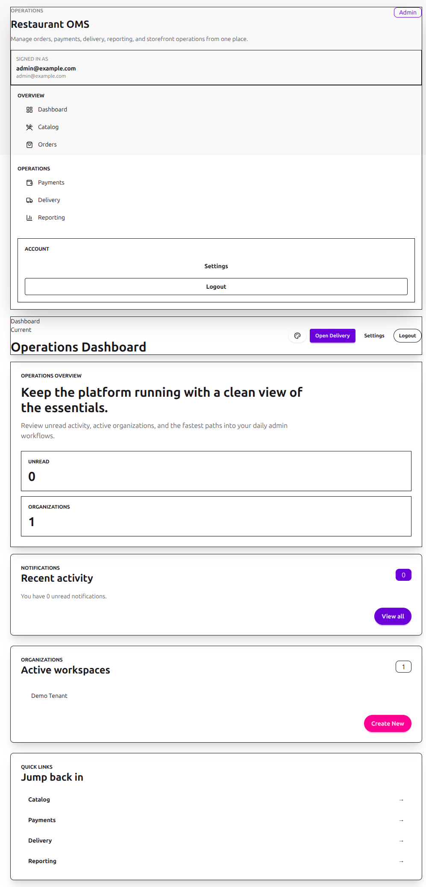
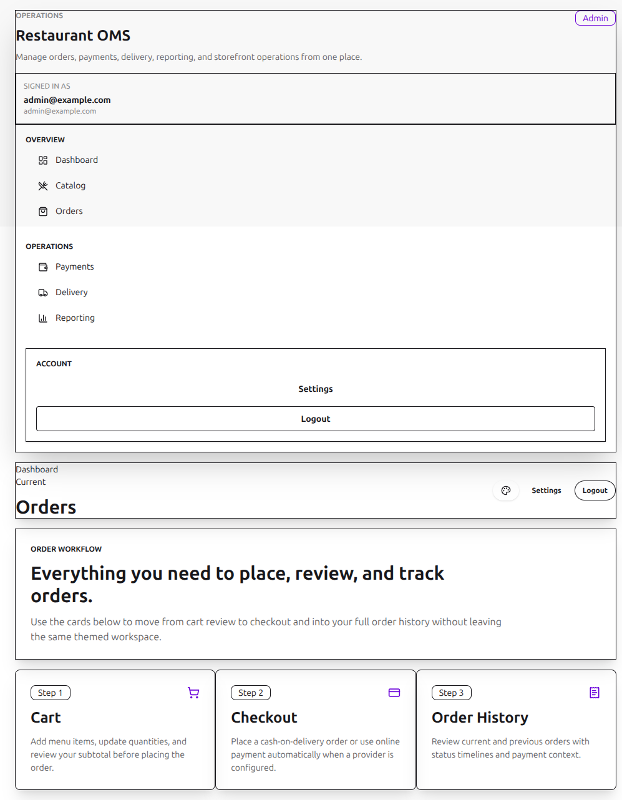
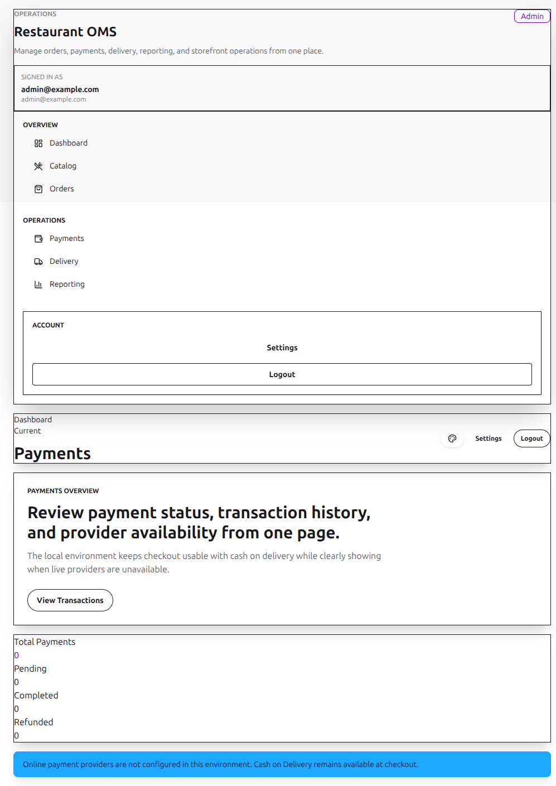
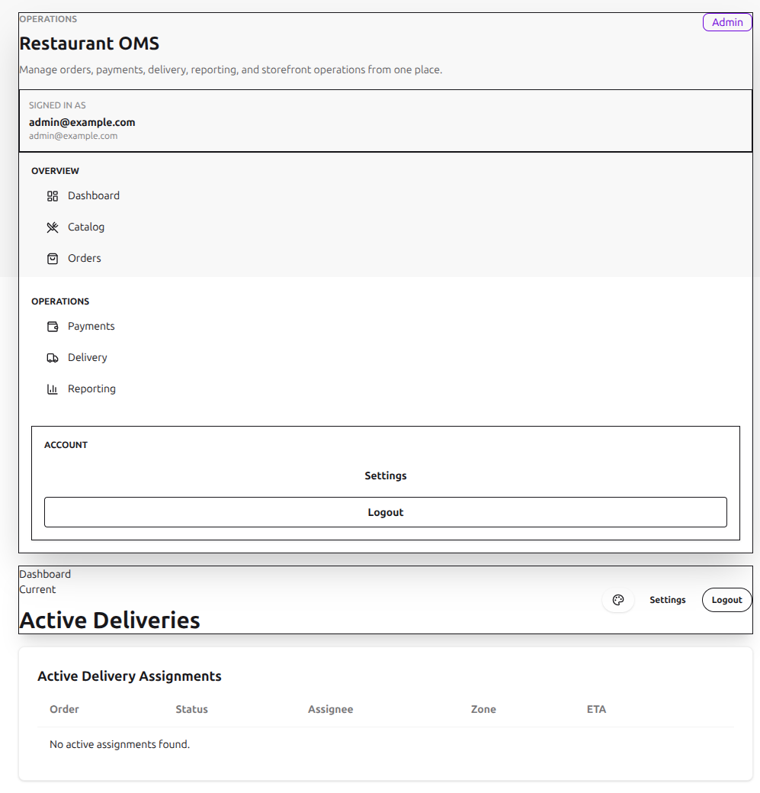
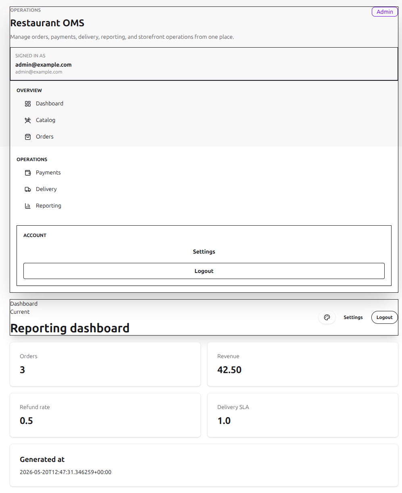
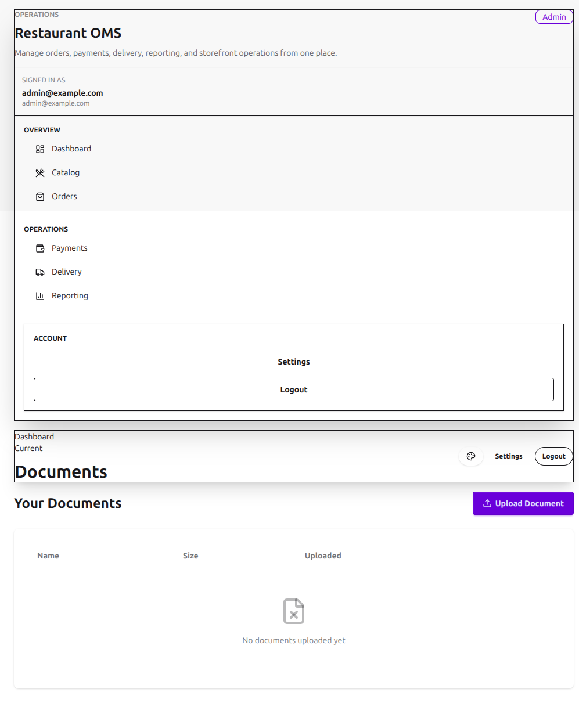
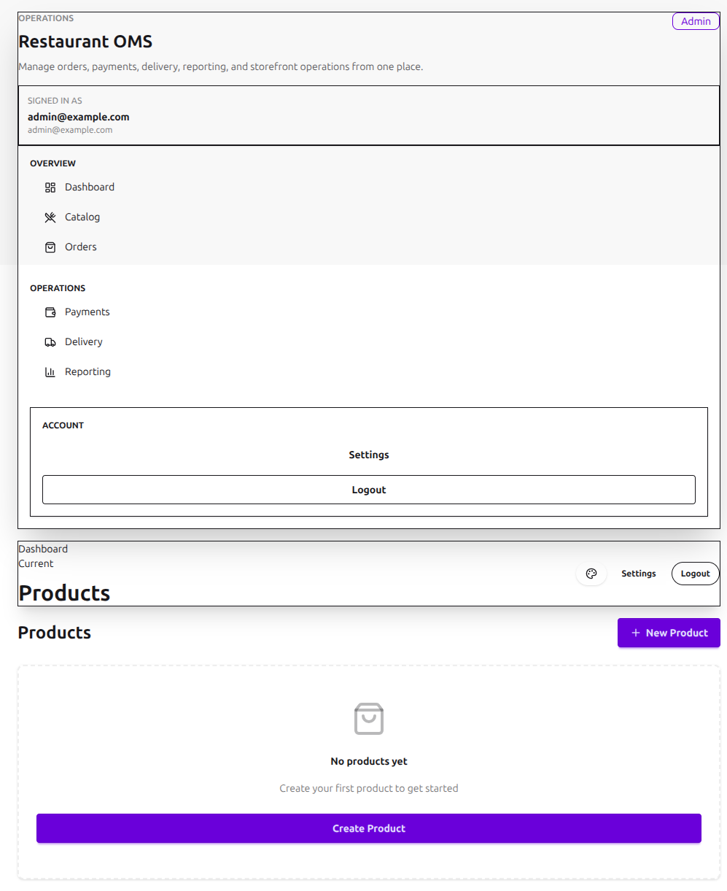
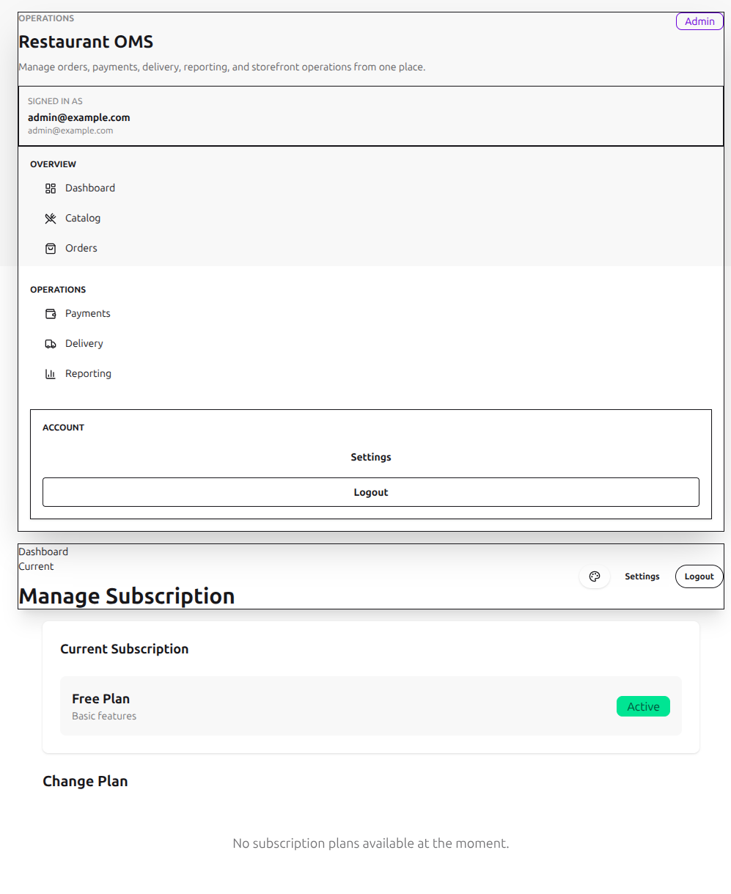
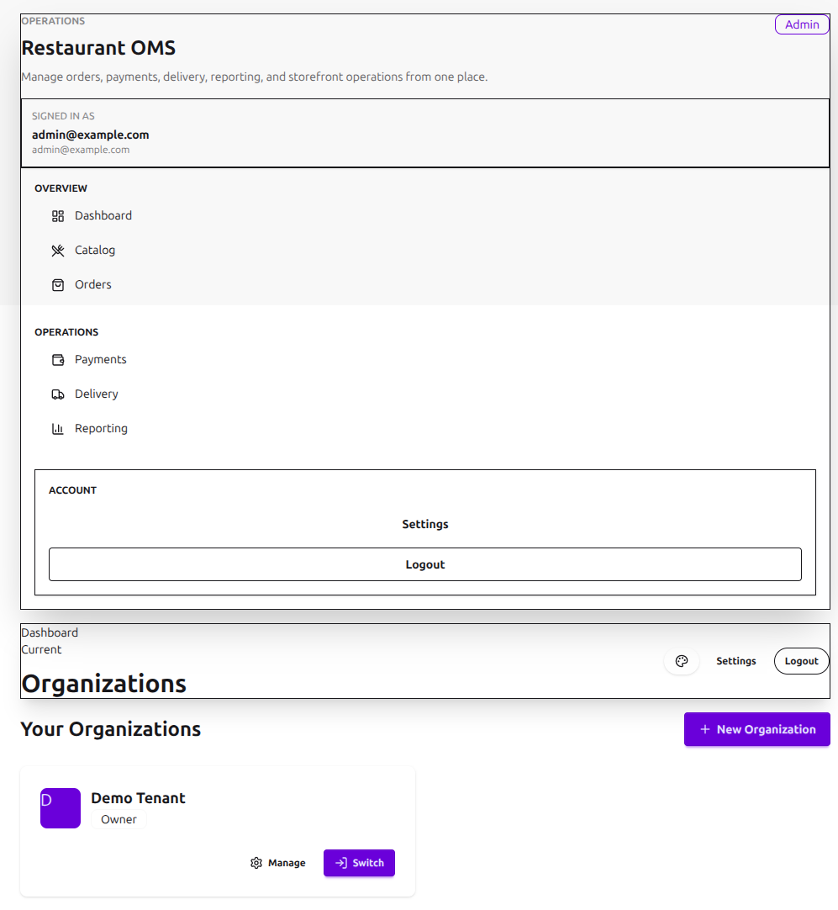
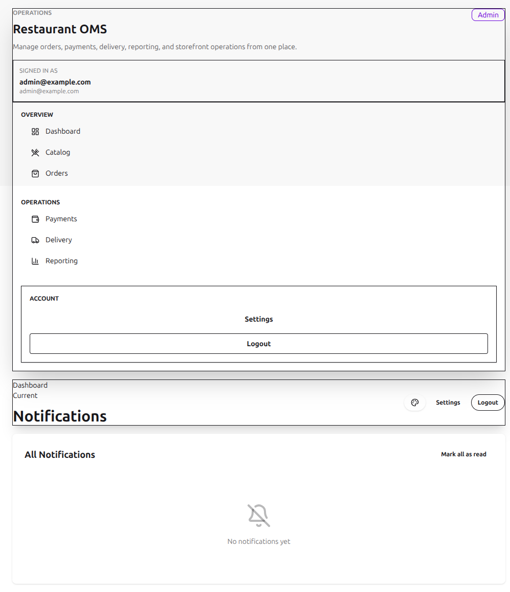

# Admin Manual

This manual reflects the admin workflows verified in the local Postgres-backed environment.

## Demo account

- Admin account: `admin@example.com` / `password123`
- Shared-page QA was also verified by temporarily promoting `customer@example.com` to admin during browser testing.

## Admin workflow

### 1. Open the admin dashboard

Sign in with the admin account to access the staff dashboard and operational quick links. The dashboard lists only active organizations in the organization card.

### 2. Review the shared orders workspace

Open the Orders page from the admin sidebar to review the shared order workflow inside the admin shell. This page now follows the same role-aware shell selection as dashboard and payments.

### 3. Review payment operations

Open the Payments page from the admin navigation to inspect summary counts, transaction history, and provider availability for the signed-in account.

### 4. Review delivery operations

The delivery dashboard shows active delivery assignments for staff users.

### 5. Review reporting

The reporting dashboard is available to staff users under the dashboard namespace.

### 6. Manage documents

Open the Documents area to upload files and review previously uploaded items. If the title is left blank during upload, the filename is used as the document title automatically.

### 7. Manage products

Use the Products area to create content-backed products and review the existing catalog content that feeds customer ordering flows.

### 8. Manage subscription plans

Use the subscription view to review the active plan state, then move into the finance flows for plan creation or selection when needed.

### 9. Manage organizations

Use the tenant management screens to create an organization, invite a member, switch the active tenant, remove memberships, and delete an organization.

### 10. Clear notifications

Use the Notifications page to mark individual notifications as read or mark all notifications as read in one action.

## Theme and environment notes

- Theme selection is available across the admin dashboard, shared order and payment pages, and the supporting management pages used in this manual.
- PostgreSQL is the only supported local database backend in the current repository state.
- The application auto-loads `.env` during Django startup.
- Social login remains hidden until valid OAuth keys are configured.
- Online payment provider actions remain informational until valid Stripe or Khalti credentials are configured.