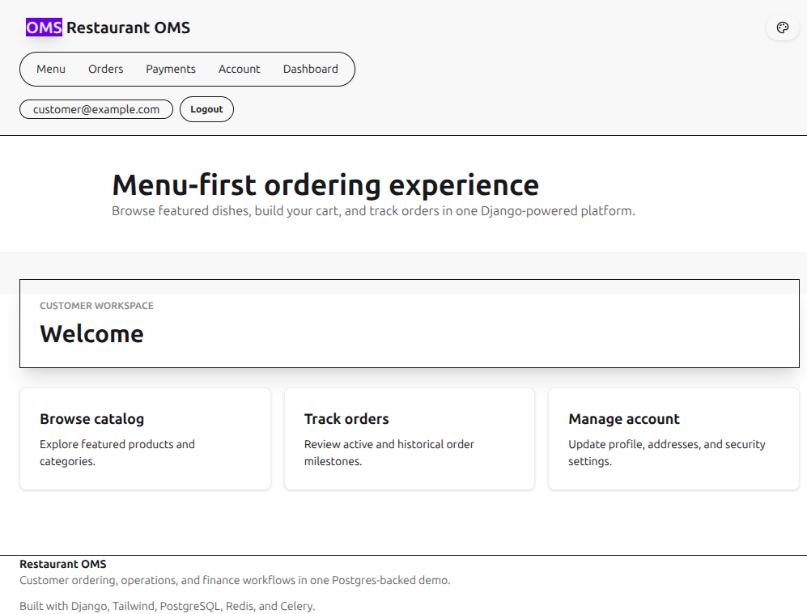
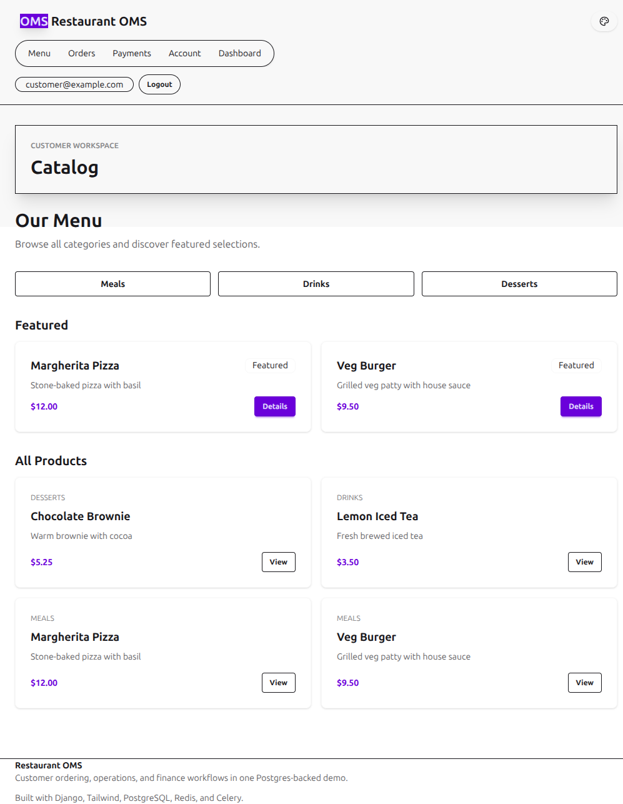
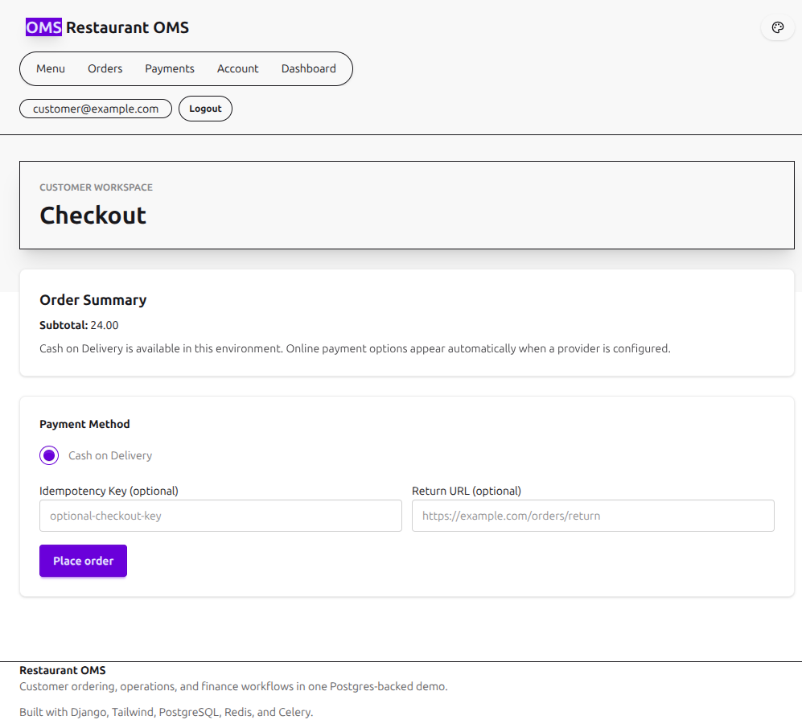
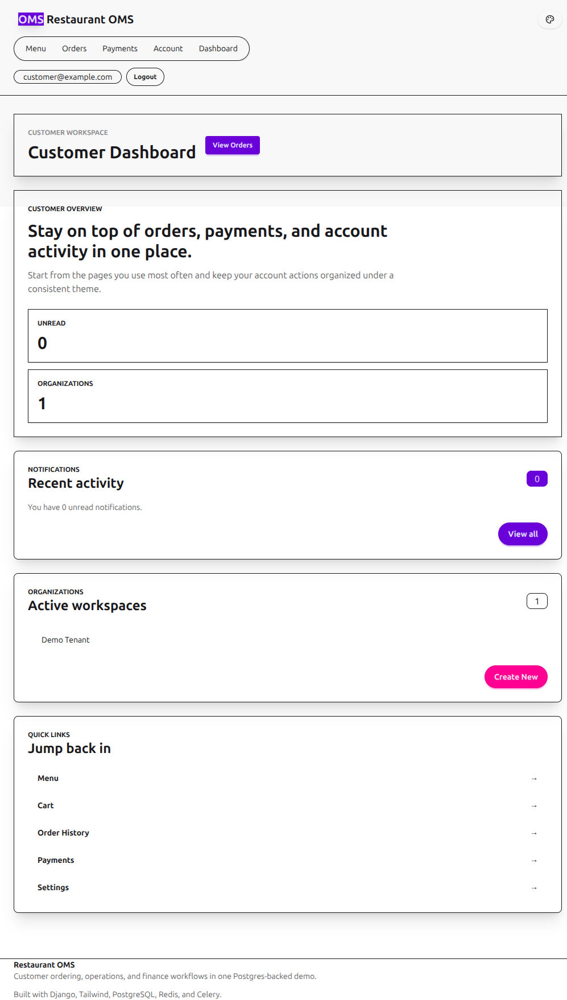
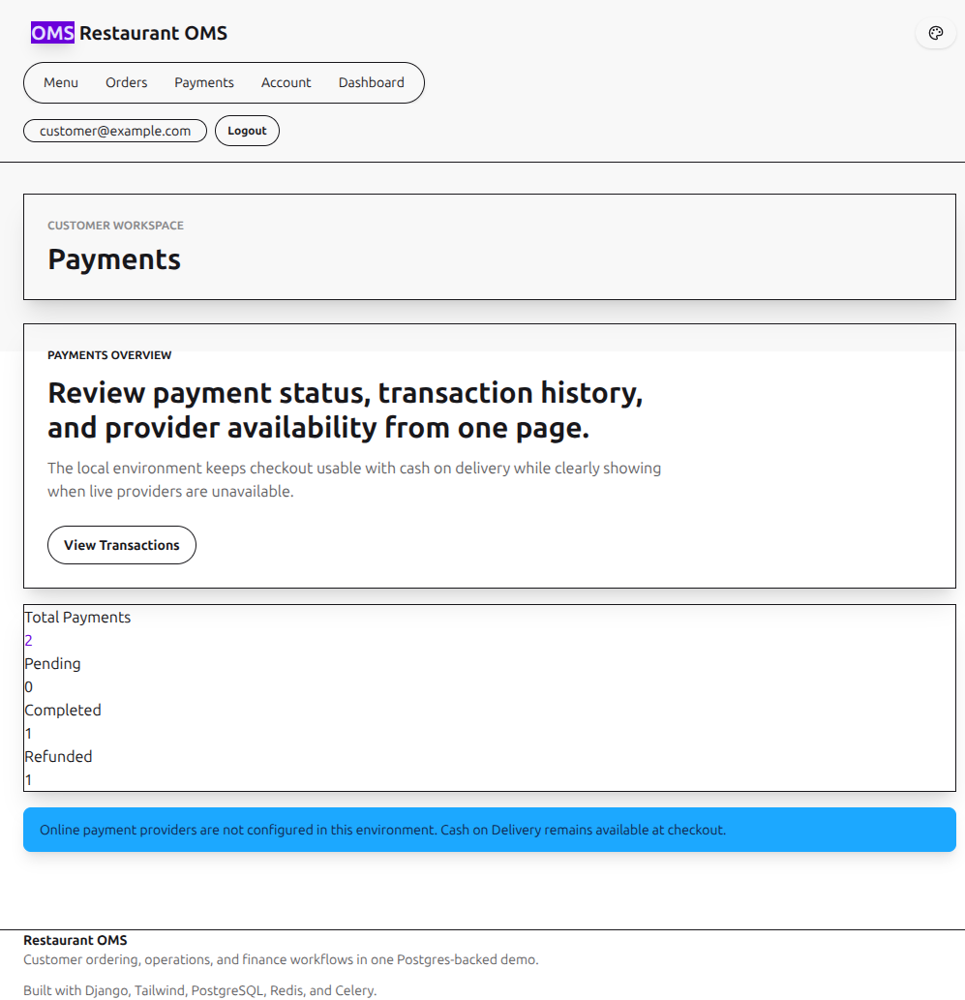
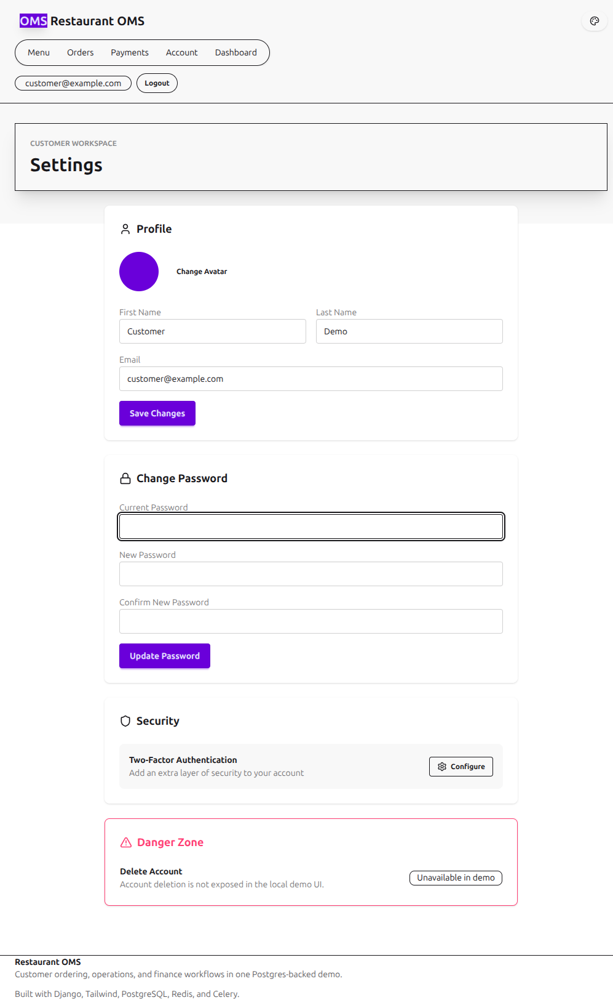
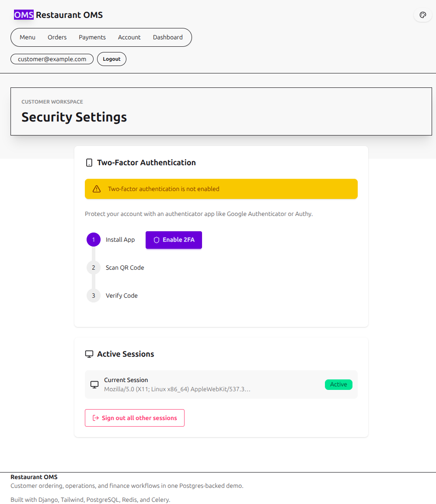

# Customer Manual

This manual reflects the customer workflows verified in the local Postgres-backed environment.

## Demo account

- Customer account: `customer@example.com` / `password123`
- For staff workflows, use `docs/manual/admin-manual.md`.

## Customer workflow

### 1. Open the storefront

Start from the home page at `http://127.0.0.1:8000/`.

### 2. Browse the catalog

Use the catalog to browse featured products, category filters, and product detail links. The catalog now follows the same customer shell and theme-selection controls as the rest of the signed-in customer experience.

### 3. Review cart and checkout

Open the Orders workspace, then move into the cart and checkout flow. In the current local environment, checkout stays usable through Cash on Delivery when online providers are not configured.

### 4. Use the customer dashboard

The dashboard provides quick access to the catalog, cart, order history, payments, and account settings.

### 5. Review payment history

The payments dashboard shows summary counts and transaction history for the signed-in customer account. Provider-backed actions remain hidden when Stripe or Khalti credentials are unavailable.

### 6. Manage profile settings

The settings page supports profile edits, password changes, and access to the security page. Account deletion is intentionally not exposed in the local demo UI.

### 7. Manage account security

Open `http://127.0.0.1:8000/settings/security/` to review 2FA setup steps and active-session controls. The `Sign out all other sessions` action is functional in the current build.

## Theme and environment notes

- Theme selection is available across auth, storefront, dashboard, catalog, orders, payments, and settings pages.
- PostgreSQL is the only supported local database backend in the current repository state.
- The application auto-loads `.env` during Django startup.
- Social login remains hidden until valid OAuth keys are configured.
- Online payment creation stays disabled until valid payment provider credentials are configured, but checkout remains usable through Cash on Delivery.