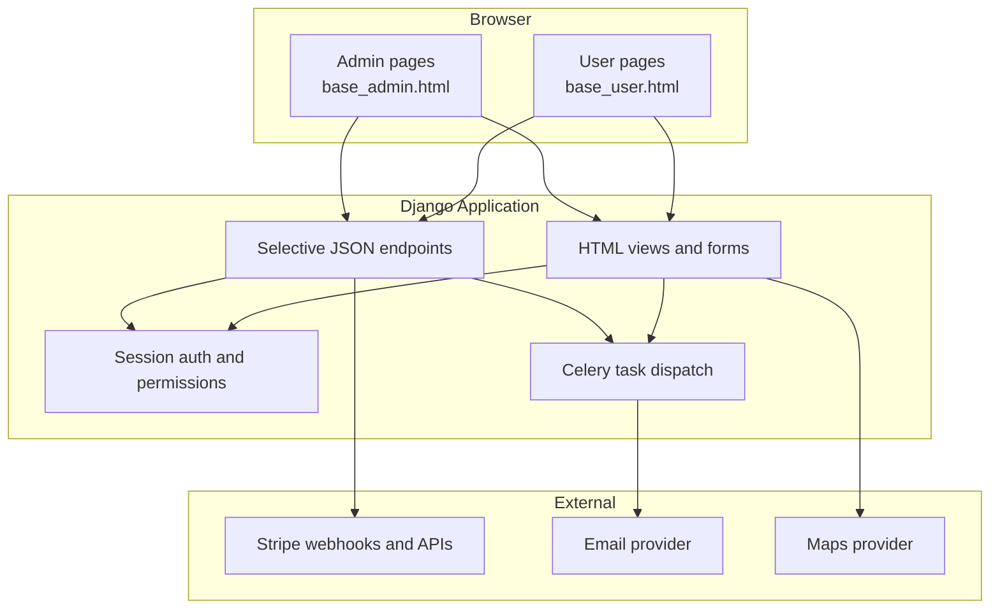

# API Design

## Overview

The OMS is primarily a server-rendered Django application. Web flows such as storefront browsing, authentication, cart management, checkout, order tracking, catalog administration, and reporting are delivered through Django views, forms, and templates. JSON APIs remain available only where they are useful for progressive enhancement, asynchronous updates, external integrations, or provider callbacks.

## Interface Model

## Primary Route Groups

| Route Group | Interface Type | Audience | Notes |
|---|---|---|---|
| `/` and storefront pages | HTML | Public / Customer | Menu browsing, landing page, product detail, cart entry points |
| `/account/*` | HTML | Customer | Profile, addresses, order history, preferences |
| `/checkout/*` | HTML + selective JSON | Customer | Checkout forms, payment initiation, validation updates |
| `/orders/*` | HTML + selective JSON | Customer / Staff | Order detail, milestones, ETA, cancellation, operational updates |
| `/dashboard/*` | HTML | Staff / Admin | Custom admin portal for catalog, orders, delivery, reports, notifications |
| `/api/*` | JSON | Internal JS, provider callbacks, external integrations | Secondary surface, not the primary frontend contract |
| `/webhooks/*` | JSON | Providers | Stripe and other signed callback endpoints |

## Authentication and Authorization

| Concern | Behavior |
|---|---|
| Authentication | Django session authentication for browser users |
| Role model | Django groups and permissions for Customer, Delivery Staff, Operations Manager, Finance, Admin |
| Staff access | Staff and admin routes guarded with permission checks and role-aware navigation |
| CSRF protection | Enabled for browser-based form submissions and AJAX requests |
| Idempotency support | Applied to critical mutations such as checkout and payment-sensitive actions |

## Template Contracts

The frontend contract is based on two base templates:

### `base_user.html`

- page title block
- hero or header content block
- main content block
- optional page actions block
- footer extras block

### `base_admin.html`

- page title block
- breadcrumbs block
- primary actions block
- sidebar navigation block
- main content block
- admin scripts block

Shared partials provide:

- alerts and flash messages
- global navigation
- cart summary access
- breadcrumbs
- footer content
- admin sidebar and top utility bar

## JSON Endpoint Guidelines

JSON endpoints should be used only when one of the following is true:

- the browser needs partial page updates without full reload
- third-party providers call back into the system
- admin dashboards need asynchronous data refresh
- reporting/export flows need polling
- external consumers require a documented machine interface

All other user-facing interactions should prefer standard Django views and forms.

## Supporting JSON Endpoints

| Method | Path | Auth Role | Description |
|---|---|---|---|
| POST | `/api/cart/items` | Customer | Add item to cart from enhanced UI interactions |
| PATCH | `/api/cart/items/{id}` | Customer | Update item quantity asynchronously |
| DELETE | `/api/cart/items/{id}` | Customer | Remove cart item asynchronously |
| POST | `/api/checkout/quote` | Customer | Recalculate totals, delivery fee, and coupon effects |
| GET | `/api/orders/{id}/timeline` | Customer / Staff | Fetch order milestone updates for live refresh |
| PATCH | `/api/delivery/assignments/{id}/status` | Delivery Staff | Update delivery status with GPS metadata |
| POST | `/api/delivery/assignments/{id}/pod` | Delivery Staff | Upload proof of delivery |
| POST | `/webhooks/stripe` | Provider | Receive signed Stripe webhook events |

## Response Conventions

| Convention | Behavior |
|---|---|
| HTML-first | Standard browser routes return rendered templates or redirects |
| JSON errors | `{ "error": "ERROR_CODE", "message": "...", "details": {...} }` |
| Pagination | Page-number or cursor pagination depending on screen and workload |
| Timestamps | ISO 8601 in persisted data; localized formatting in rendered templates |
| Soft deletes | Admin workflows archive records instead of hard-deleting where business history matters |

## Notes

- The system does not assume a separate SPA frontend.
- The custom admin/staff portal is not limited to Django's stock admin site.
- JSON APIs support the web application and integrations; they are not the primary product interface.
