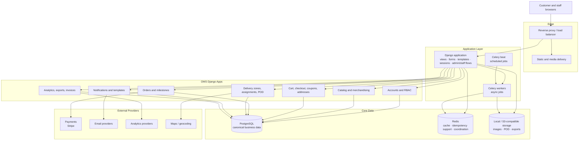

# Architecture Diagram

## Overview

This document describes the current target architecture for the restaurant-focused Order Management System. The implementation is a Django monolith that serves both backend behavior and frontend HTML, with Tailwind CSS used for the customer and admin interfaces.

## Solution Architecture

## Module Responsibilities

| Module | Runtime | Responsibilities |
|---|---|---|
| Django Web App | Python / Django | Storefront, customer account flows, staff/admin dashboards, forms, permissions, domain orchestration |
| Tailwind Template Layer | Django templates + Tailwind | Shared design system, layout shells, partials, responsive UI primitives |
| Celery Workers | Python / Celery | Notifications, exports, retries, reconciliation, scheduled maintenance jobs |
| PostgreSQL | PostgreSQL | System of record for customers, catalog, orders, delivery, refunds, and reports |
| Redis | Redis | Idempotency support, cache, and lightweight coordination |
| Object Storage | Local or S3-compatible | Product images, POD artifacts, generated invoices and reports |

## Frontend Layout Model

| Layout | Template | Audience | Responsibilities |
|---|---|---|---|
| User layout | `templates/base_user.html` | Customers and public visitors | Marketing header, menu browsing, account links, cart access, soft brand presentation |
| Admin layout | `templates/base_admin.html` | Staff and admins | Sidebar navigation, utility header, breadcrumbs, dense tables/forms, permission-aware operations |

## Cross-Cutting Concerns

| Concern | Implementation |
|---|---|
| Authentication | Django session auth with login, logout, password reset, and optional MFA extensions |
| Authorization | Django groups, permissions, and staff/admin access checks enforced in views and templates |
| Layouts | Template inheritance with shared partials and block contracts for `base_user.html` and `base_admin.html` |
| Styling | Tailwind CSS with shared tokens for spacing, color, typography, and responsive breakpoints |
| Background work | Celery-backed async jobs and scheduled tasks |
| Notifications | Provider abstraction for email delivery and template rendering |
| Storage | Local-first object storage with optional S3-compatible deployment |
| Observability | Structured logging, metrics, health checks, and reporting instrumentation |
