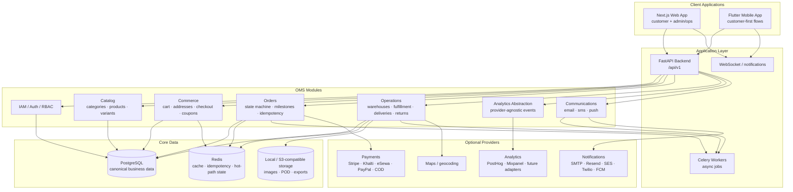

# Architecture Diagram

## Overview

This document describes the shipped application architecture for the restaurant-focused Order Management System. The implementation is built around a single FastAPI backend, a Next.js web application, and a Flutter mobile application. Cloud vendors remain optional deployment targets and provider integrations, not the source of truth for runtime design.

## Solution Architecture

## Module Responsibilities

| Module | Runtime | Responsibilities |
|---|---|---|
| Web App | Next.js | Restaurant storefront, customer account flows, admin and operations dashboards |
| Mobile App | Flutter | Customer menu browsing, cart, checkout, orders, profile, addresses |
| FastAPI Backend | Python / FastAPI | Public API, OMS domain logic, auth, RBAC, validation, orchestration |
| Celery Workers | Python / Celery | Reservation expiry, notifications, exports, reconciliation, deferred operations |
| PostgreSQL | SQLModel / PostgreSQL | System of record for customers, catalog, orders, fulfillment, delivery, returns |
| Redis | Redis | Idempotency keys, lightweight coordination, cached hot-path data |
| Object Storage | Local or S3-compatible | Product images, proof-of-delivery artifacts, generated exports |

## Cross-Cutting Concerns

| Concern | Implementation |
|---|---|
| Authentication | FastAPI JWT/session model with existing auth module and optional OTP/social login |
| Authorization | Role-based access enforced in FastAPI and reflected in web/mobile route handling |
| Idempotency | `Idempotency-Key` on OMS mutations, backed by Redis and persisted OMS state |
| State Management | Explicit order, fulfillment, delivery, and return transitions in the OMS service layer |
| Analytics | Provider-agnostic adapter layer for backend, web, and mobile |
| Notifications | Provider abstraction for email, SMS, push, and in-app delivery |
| Storage | Local-first object storage with S3-compatible deployment option |
| Observability | Structured logging, metrics, and analytics/reporting endpoints inside the app stack |
