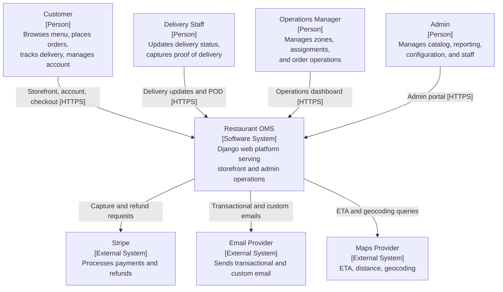
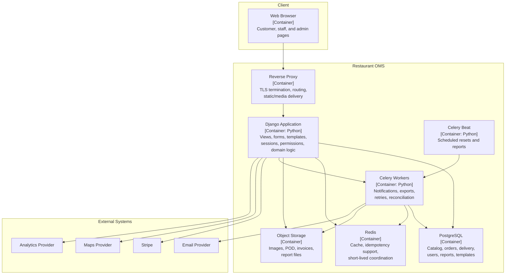

# C4 Context and Container Diagrams

## C4 Context Diagram

## C4 Container Diagram

## Container Responsibilities and Communication

| Container | Runtime | Communication Style | Data Owned |
|---|---|---|---|
| Reverse Proxy | Managed | HTTPS | None |
| Django Application | Python / Django | Synchronous web requests, template rendering, selective JSON endpoints | Business rules and primary request handling |
| Celery Workers | Python / Celery | Async task execution | Deferred workflows and scheduled work |
| Celery Beat | Python / Celery | Scheduled task dispatch | None |
| PostgreSQL | PostgreSQL | ORM and SQL access | Users, catalog, carts, orders, delivery, refunds, reports |
| Redis | Redis | Cache and coordination | Derived or short-lived state only |
| Object Storage | Local or S3-compatible | File reads/writes | Product media, POD artifacts, exports |

## Frontend Container Contract

The Django application exposes two template shells as the primary frontend contract:

- `base_user.html` for storefront and customer account pages
- `base_admin.html` for staff and admin operations pages

Leaf templates extend one of these layouts and fill named blocks for titles, actions, navigation context, and page content. Shared partials provide headers, footers, breadcrumbs, alerts, and sidebar navigation.
