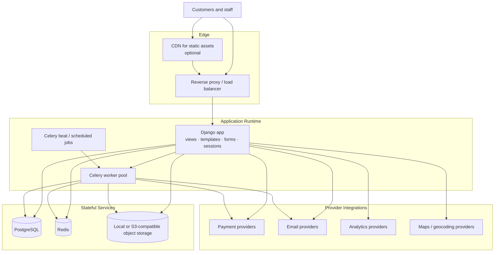

# Cloud Architecture

## Overview

The OMS is deployment-agnostic at the application layer. The concrete implementation described by this documentation is a Django web platform with Tailwind-powered server-rendered templates, PostgreSQL, Redis, Celery, and object storage as the core infrastructure building blocks.

## Runtime Topology

## Primary Infrastructure Contracts

| Concern | Primary Choice | Notes |
|---|---|---|
| Transactional data | PostgreSQL | Canonical store for catalog, orders, delivery, refunds, reporting, and RBAC |
| Cache and coordination | Redis | Caching, idempotency support, rate limiting, short-lived state |
| Background work | Celery | Notifications, exports, retries, reconciliation, scheduled resets |
| Binary assets | Local storage or S3-compatible bucket | Product media, POD evidence, report files, invoices |
| Web hosting | Django application runtime | Served behind a reverse proxy with static and media file handling |
| Frontend assets | Tailwind-generated CSS and static files | Delivered through Django static files and optional CDN |

## Deployment Modes

### Local Development

- Django app served locally
- Tailwind assets built locally and collected as static files
- PostgreSQL and Redis via local containers or local services
- Celery workers and scheduler running beside the web app
- Object storage backed by filesystem

### Single-Environment Production

- Reverse proxy in front of the Django application
- Dedicated PostgreSQL instance with backups
- Redis for cache and idempotency support
- Celery workers and scheduler running separately from web processes
- Local or S3-compatible object storage
- Static and media routing configured at the proxy or CDN layer

### Scaled Production

- Multiple Django application instances behind a load balancer
- Multiple worker replicas by queue type
- Managed PostgreSQL with replicas if needed for reporting
- Managed Redis
- CDN in front of static assets
- Optional S3-compatible object storage and external analytics providers

## OMS-Specific Background Jobs

| Job | Trigger | Result |
|---|---|---|
| Product availability reset | Scheduled | Restore daily availability defaults for the next service day |
| Notification dispatch | Domain events and admin actions | Send order, delivery, refund, and broadcast emails |
| Report and export generation | User request or schedule | Produce XLSX, CSV, PDF, and printable files |
| Payment reconciliation | Scheduled | Reconcile provider status with OMS records |
| ETA refresh | Order events and delivery updates | Refresh customer-visible timing estimates |
| Deferred refund follow-up | Retry policy | Retry or escalate refund state |

## Frontend Delivery Notes

The web UI is server-rendered by Django and organized around two layout shells:

- `base_user.html` for public and customer pages
- `base_admin.html` for staff and admin pages

Tailwind styles both layouts through shared tokens and utility classes. Static CSS, JavaScript, and image assets should be packaged through Django static files and optionally served via CDN.
