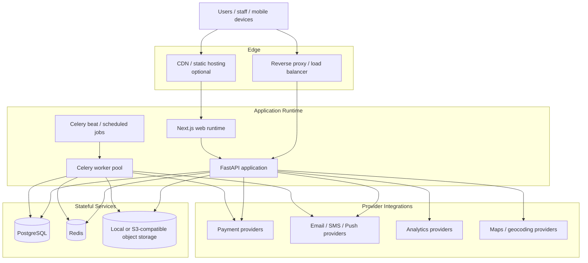

# Cloud Architecture

## Overview

The OMS is deployment-agnostic at the application layer. The concrete implementation in this repository is FastAPI, Next.js, and Flutter, with PostgreSQL, Redis, Celery, and object storage as the core infrastructure building blocks. Cloud providers are selected through adapters and deployment configuration, not through hardcoded architectural assumptions.

## Runtime Topology

## Primary Infrastructure Contracts

| Concern | Primary Choice | Notes |
|---|---|---|
| Transactional data | PostgreSQL | Canonical store for catalog, orders, warehouse, delivery, returns, RBAC |
| Cache and coordination | Redis | Idempotency, reservation TTLs, rate limiting, short-lived state |
| Background work | Celery | Notifications, reservation expiry, exports, retries, reconciliation |
| Binary assets | Local storage or S3-compatible bucket | Product media, POD evidence, report files |
| Frontend hosting | Next.js runtime or exported deployment | Can sit behind any CDN or reverse proxy |
| Mobile distribution | Flutter app stores / internal builds | Same API contracts as web |

## Deployment Modes

### Local Development

- FastAPI app served locally
- Next.js app served locally
- Flutter app pointed at local API
- PostgreSQL and Redis via local containers or local services
- Object storage backed by filesystem

### Single-Environment Production

- Reverse proxy in front of FastAPI and Next.js
- Dedicated PostgreSQL instance with backups
- Redis for cache and idempotency
- Celery workers and scheduler running separately from the API
- Local or S3-compatible object storage

### Scaled Production

- Multiple FastAPI instances behind a load balancer
- Multiple worker replicas by queue type
- Managed PostgreSQL with replicas if needed for reporting
- Managed Redis
- CDN in front of static assets and the web frontend
- Optional S3-compatible object storage and external analytics providers

## OMS-Specific Background Jobs

| Job | Trigger | Result |
|---|---|---|
| Inventory reservation expiry | Scheduled / TTL-driven | Release reserved stock for stale checkout sessions |
| Notification dispatch | Domain events | Send order, delivery, and return updates |
| Manifest / export generation | User request or schedule | Produce downloadable operational files |
| Payment reconciliation | Scheduled | Reconcile provider status with OMS records |
| Low-stock alerting | Threshold breach | Notify operations users |
| Deferred refund follow-up | Return review / failure retry | Retry or escalate refund state |

## Provider Strategy

The application exposes provider interfaces for:

- payments
- notifications
- analytics
- object storage
- maps and geocoding

This keeps PostHog, Mixpanel, Stripe, SES, Twilio, S3-compatible storage, and future providers swappable without changing OMS domain call sites.
